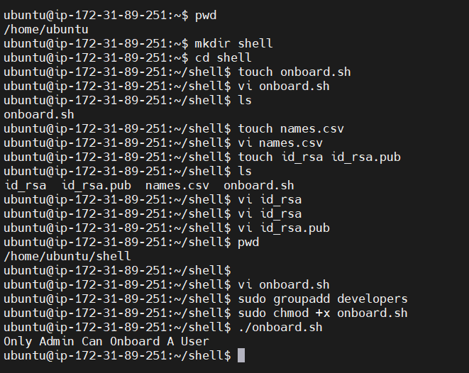
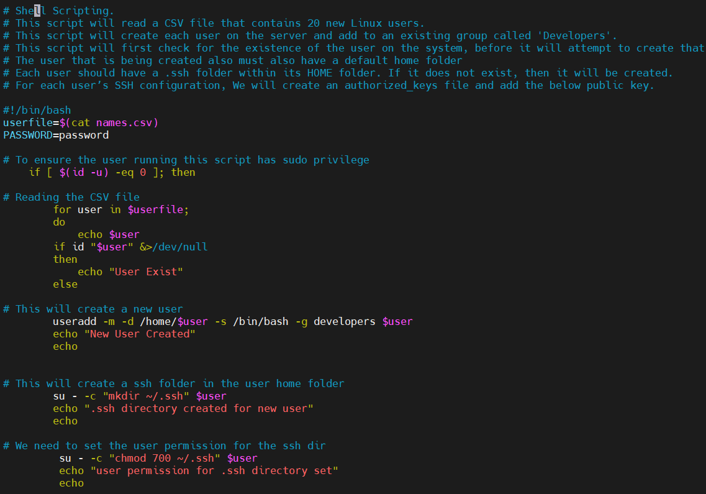
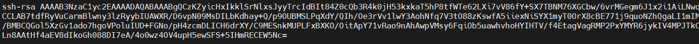
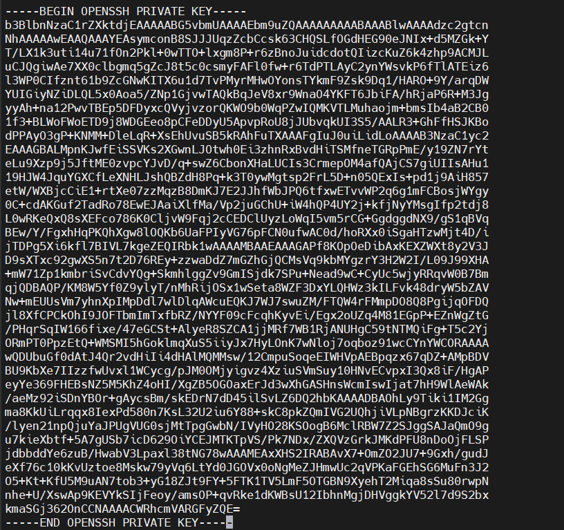
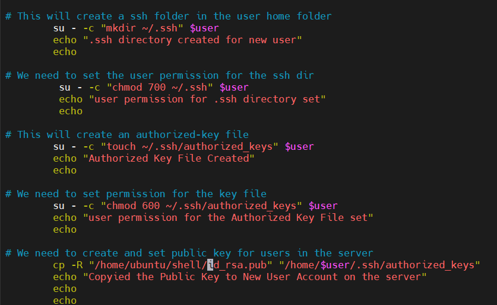
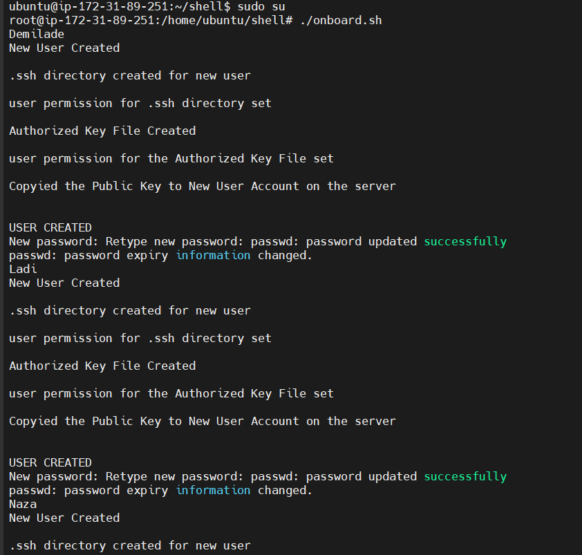
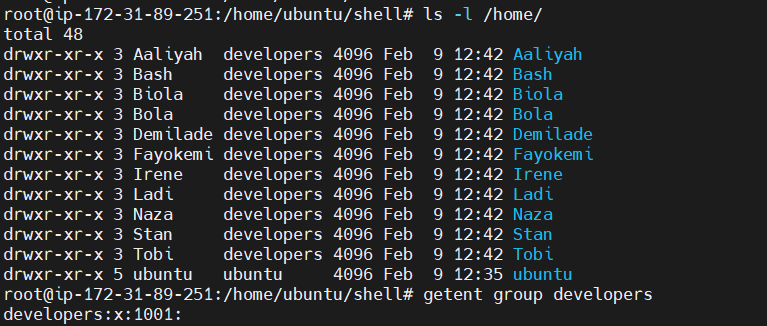
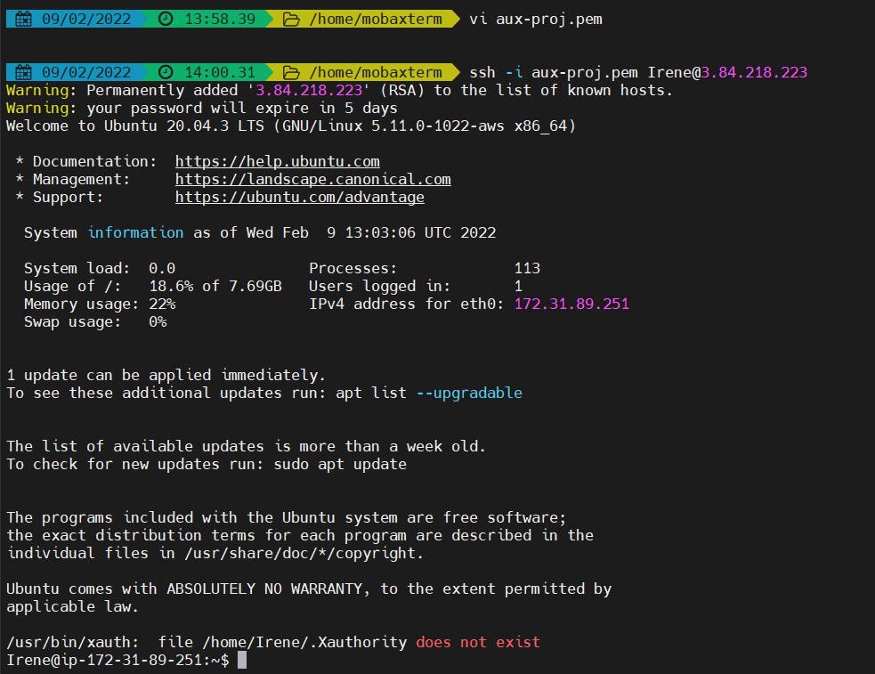
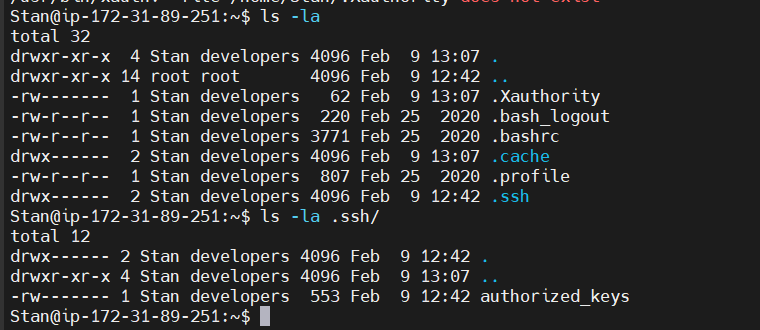

# Aux Project

## Shell Scripting

creating the shell directory and entering the directory

` $ mkdir shell && cd shell`

creating the names.csv file and opening the file

` $ touch names.csv`

` $ vim names.csv`

type different names into the file

create the private and public key files and populate them with the appropriate keys

` $ touch id_rsa id_rsa.pub`

` $ vi id_rsa`

` $ vi id_rsa.pub`

create the file containing the shell script and populate with the necessary script

` $ vi onboard.sh`

create the developers group for the newly added users

` $ sudo groupadd developers`

make the script file an executable

` $ sudo chmod +x onboard.sh`

test the script to ensure everything is right 

` $ ./onboard.sh`

updating the filepath to the public key

switching into super user to run the file containing the script 

` $ sudo su`

` $ ./onboard.sh`

from root, access all the users and confirm the developers group was created

` $ ls -l /home/`

` $ getent group developers`

testing a few of the users to confirm that i am able to connect to the server using the private and public key

aux-proj.pem is the file containing the public key on the new terminal - to ensure i'm able to connect to each user's server

` $ ssh -i aux-pro.pem username@pubip`

